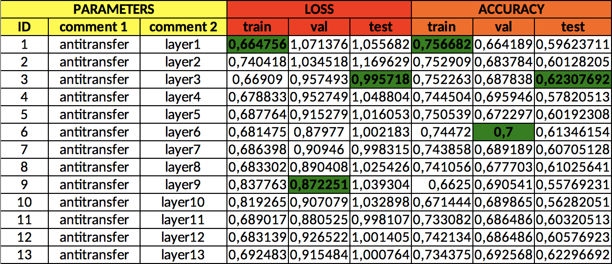

# Blissful Ignorance: Anti-Transfer Learning for Task Invariance
This repository supports the above paper submitted for NeurIPS2020.
This code produces the results mentioned in the paper, using the same configuration described in the original work.

## REQUIREMENTS
We used these exact packages versions:
* python 3.5
* ipython 7.1.1
* numpy 1.15.4
* scipy 1.4.1
* librosa 0.6.3
* matplotlib 3.0..3
* torch 1.4.0
* torchvision 0.2.2.post3
* essentia 2.1b5.dev532
* pandas 0.24.2
* soundfile 0.9.0.post1
* scikit-learn 0.20.3
* xlswriter 1.1.8
* configparser 2.19

To install everything at once please run:

```bash
pip install -r requirements.txt
```
## PREPARE DATA
### Iemocap
* Follow these instructions to download the dataset: https://sail.usc.edu/iemocap/
* Open the config/config.ini file and put the dataset path on [preprocessing]-input_iemocap_folder
* In the config/config.ini file put [pretrqining]-sequence_length = 4
* Run the following scripts to pre-process the dataset both with random and speaker-wise train/val/test split for emotion recognition and with random split for speaker recognition.
```bash
python3 preprocessing_IEMOCAP_randsplit.py
python3 preprocessing_IEMOCAP_actorsplit.py
python3 preprocessing_IEMOCAP_randsplit_SPEAKER.py
```
### Good-Sounds
* Download dataset: https://www.upf.edu/web/mtg/good-sounds
* Open the config/config.ini file and put the dataset path on [preprocessing]-input_good-sounds_folder
* In the config/config.ini file put [pretrqining]-sequence_length = 6
* Run the following scripts to pre-process the dataset both with random and instrument-wise train/val/test split for sound goodness estimation and with random split for instrument recognition.
```bash
python3 preprocessing_GOODSOUNDS_randsplit.py
python3 preprocessing_GOODSOUNDS_actorsplit.py
python3 preprocessing_GOODSOUNDS_randsplit_INSTRUMENT.py
```
### Librispeech
* Follow these instructions to download and prepare the dataset: https://github.com/bepierre/SpeechVGG. (We used the 100 hours version)
* Open the config/config.ini file and put the dataset path on [preprocessing]-input_librispeech_folder
* In the config/config.ini file put [pretrqining]-sequence_length = 4
* Run the following script to pre-process the dataset.
```bash
python3 preprocessing_LIBRISPEECH.py
```
### Nsynth
* Download dataset: https://magenta.tensorflow.org/datasets/nsynth
* Put training, validation and test folders in the same folder
* Open the config/config.ini file and put the dataset path on [preprocessing]-input_nsynth_folder
* In the config/config.ini file put [pretrqining]-sequence_length = 6
* Run the following script to pre-process the dataset.
```bash
python3 preprocessing_NSYNTH.py
```

## PRE-TRAIN DEEP FEATURE EXTRACTORS
When the preprocessing stage is finished, separately run the following scripts to pre-train the feature extractors:
```bash
python3 pretrain_vgg_iemocap.py
python3 pretrain_vgg_goodsounds.py
python3 pretrain_vgg_librispeech.py
python3 pretrain_vgg_nsynth.py
```
The pre-trained convolution part of these VGG networks will be used to compute the deep feature losses in the actual trainings.
Depending on the used GPU, it may be necessary to modify the batch_size variable inside these scripts.

## TRAIN MODELS
When all pre-trainings are completed, run the actual trainings to obtain the results exposed in the original paper. The experiments_antitransfer folder contains all configuration files for the experiments to run. Each configuration file contains several single training instances. The file naming describes each configuration: ID_training-dataset_split-type_pretraining-dataset
* ID 1-4 are the baseline. Here no anti-transfer nor weight initialization is applied. We compute 20 times all baseline experiments to look at random fluctuations.
* In ID 10-17  weight-initialization, but no anti-transfer is applied. We compute 3 times each configuration to look at random fluctuations.
* In ID 20-27 we apply anti-transfer learning (and no weight initialization). Each configuration is tested computing the anti-transfer loss in each of the 13 convolution layers of the VGG16 networks.

To run these experiments use the experiments_manager.py script inside the ipython environment, applying the following positional parameters:
1. IDs of experiments to run (python list)
2. GPU ID (int)
3. first instance to compute (OPTIONAL, int)
4. last instance to compute (OPTIONAL, int)

example:
```python
run experiments_manager [20,21,22,23] 0
```

The results are automatically saved in the ../results/experiment_*ID directory. These items are saved for every experiment:
* description.txt file containing a brief description of the experiment configuration
* models folder containing all saved weights of the models
* results folder containing the individial results of each experiment instance (saved as numpy dictionaries), a list of all used parameters for each instance (in the results/parameters folder) and an immediately-readable .xls spreadsheet that shows the most important result values of each experiment instance.

Example spreadsheet (Emotion recognition on speaker-wise split (IEMOCAP) with pre-training on speaker recognition (IEMOCAP)):
<p align="center">

</p>

In the two "comment" columns the main parameters of an experiment instance are shown. Best loss/accuracy are highlighted in green for every column.


## GENERATE PLOTS
Run the following scripts to produce the plots included in the paper
(our result values are hard-coded in the scripts).
```bash
python3 plot_accuracy_boost.py
python3 plot_loss_epochs.py
python3 plot_perLayer_improvement.py
```
